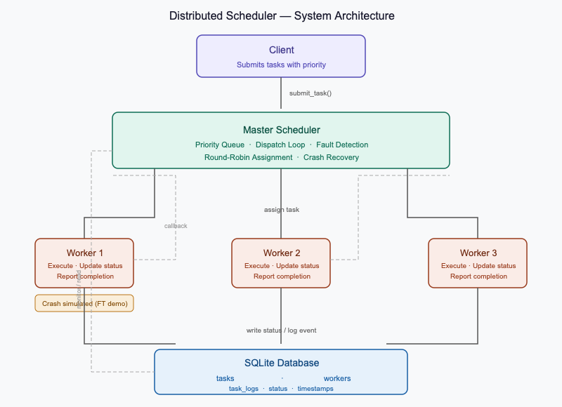

# Distributed Scheduler

A Python-based simulation of a Distributed Task Scheduler demonstrating task distribution, fault tolerance, and real-time monitoring using SQLite.

---

## Project Overview

This project simulates a production-style distributed scheduler with three core components:

- **Master Scheduler** — maintains a priority task queue, dispatches tasks to available workers, detects failures and reassigns tasks
- **Worker Nodes** — multithreaded workers that execute tasks, update status, and report back to the master
- **SQLite Database** — persists all task and worker state including start times, completion times, failures, and logs

### Key Features

| Feature | Description |
|---|---|
| Priority Queue | Tasks dispatched by priority (1 = highest) |
| Multithreaded Workers | Each worker runs in its own thread |
| Fault Tolerance | Worker crash simulation with automatic task re-queuing |
| Task Retry | Failed tasks retried up to `max_attempts` (default 3) |
| Structured Logging | Timestamped logs for every state transition |
| SQLite Persistence | Full audit trail across tasks, workers, and events |

---

## System Architecture




---

## Dependencies

This project uses **only the Python standard library**. No pip installs required to run the scheduler.

```
Python >= 3.10
sqlite3       (built-in)
threading     (built-in)
queue         (built-in)
logging       (built-in)
uuid          (built-in)
dataclasses   (built-in)
```


Install optional deps:
```bash
pip install -r requirements.txt
```

---

## Setup Instructions

### 1. Clone the repository

```bash
git clone https://github.com/rehman0601/Designing-a-Distributed-Scheduler.git
cd Designing-a-Distributed-Scheduler
```

### 2. Verify Python version

```bash
python --version   # Must be 3.10+
```

### 3. (Optional) Install doc dependencies

```bash
pip install -r requirements.txt
```

---

## Execution Steps

### Run the full simulation

```bash
python distributed_scheduler.py
```

This will:
1. Initialize the SQLite database (`scheduler.db`)
2. Spawn 3 worker nodes
3. Submit 10 tasks with varying priorities
4. Simulate a Worker-1 crash after 2 seconds
5. Submit 5 more tasks (demonstrating fault tolerance)
6. Wait for all tasks to complete
7. Print a full execution report

### Sample output

```
═════════════════════════════════════════════════════════════════
  DISTRIBUTED SCHEDULER — SIMULATION DEMO
═════════════════════════════════════════════════════════════════

[Phase 1] Submitting 10 tasks…
[Phase 2] Simulating Worker-1 crash for fault tolerance demo…
[Phase 3] Submitting 5 more tasks after crash…
[Waiting for all tasks to complete…]

Task Summary:
  COMPLETED    15  ███████████████

  Total Reassignments : 1
  Worker Crashes      : 1

Worker Status:
  Name         Status     Tasks Done   Alive
  Worker-1     IDLE       3            (offline)
  Worker-2     IDLE       6            Yes
  Worker-3     IDLE       6            Yes
```

### Inspect the database

```bash
sqlite3 scheduler.db

-- View all tasks
SELECT task_id, name, status, duration_ms FROM tasks;

-- View workers
SELECT name, status, task_count FROM workers;

-- View event log
SELECT task_id, event, detail, ts FROM task_logs ORDER BY ts;
```

### Use as a library

```python
from distributed_scheduler import Database, MasterScheduler

db = Database("my_scheduler.db")
scheduler = MasterScheduler(db, num_workers=5)
scheduler.start()

# Submit tasks
scheduler.submit_task("Process Report", payload="file=q1.csv", priority=2)
scheduler.submit_task("Send Emails", priority=5)

# Wait and shut down
scheduler.wait_for_completion(timeout=60)
scheduler.shutdown()
scheduler.print_report()
```

---

## Project Structure

```
distributed-scheduler/
├── distributed_scheduler.py    # Main source — all components
├── requirements.txt            # Dependencies
├── architecture_diagram.png    # System architecture diagram
├── README.md                   # This file
├── documentation.pdf           # Full project documentation
└── scheduler.db                # Generated at runtime (SQLite)
```

---

## Database Schema

**tasks**
| Column | Type | Description |
|---|---|---|
| task_id | TEXT PK | UUID |
| name | TEXT | Task display name |
| payload | TEXT | Task input data |
| status | TEXT | PENDING / ASSIGNED / RUNNING / COMPLETED / FAILED |
| priority | INTEGER | 1 (highest) to 10 (lowest) |
| worker_id | TEXT FK | Assigned worker |
| attempts | INTEGER | Retry count |
| max_attempts | INTEGER | Retry limit (default 3) |
| created_at | TEXT | ISO 8601 timestamp |
| started_at | TEXT | Execution start time |
| completed_at | TEXT | Execution end time |
| duration_ms | INTEGER | Execution duration in ms |
| error_msg | TEXT | Failure reason if any |

**workers**
| Column | Type | Description |
|---|---|---|
| worker_id | TEXT PK | UUID |
| name | TEXT | Worker display name |
| status | TEXT | IDLE / BUSY / OFFLINE |
| task_count | INTEGER | Completed task count |
| registered_at | TEXT | ISO 8601 timestamp |
| last_seen | TEXT | Last heartbeat time |

**task_logs**
| Column | Type | Description |
|---|---|---|
| log_id | INTEGER PK | Auto-increment |
| task_id | TEXT | Task reference |
| worker_id | TEXT | Worker reference |
| event | TEXT | SUBMITTED / ASSIGNED / STARTED / COMPLETED / FAILED / REQUEUED |
| detail | TEXT | Extra context |
| ts | TEXT | ISO 8601 timestamp |

---

## GitHub Repository

[https://github.com/rehman0601/Designing-a-Distributed-Scheduler](https://github.com/rehman0601/Designing-a-Distributed-Scheduler)

---

## Author

**Rehman** — BTech CSE, ITM Skills University  
Project: Distributed Scheduler Simulation
